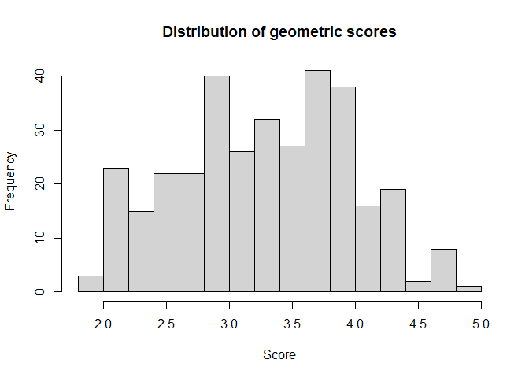

Which certified infant and child car seats are the safest?
================
fboulnois
2022-06-26

## Summary

Many infant and child car seats are available on Amazon, but which are
truly safe? The [National Highway Traffic Safety
Administration](https://www.nhtsa.gov) has a [Car Seat Finder
tool](https://www.nhtsa.gov/equipment/car-seats-and-booster-seats) but
unfortunately it is difficult to compare and contrast car seats across
brands, features, and ratings.

To investigate in more detail I downloaded the raw NHTSA car seat data
and analyzed it using R. I was also interested in highly rated car seats
that are part of travel systems. These travel systems usually have a
stroller and infant car seat combo but these seats are almost never
convertible / multifunction. I cross-referenced the seat model of the
most popular travel systems with the NHTSA data.

The car seat data was analyzed in a few different dimensions:

-   Which car seats have the highest combined rating by geometric score
-   Which convertible (multifunction) car seats have the highest score
-   Which convertible car seats have an overall rating of 5 in any
    category
-   Which travel system car seats have the highest score

## Methods

### Data preparation

To keep this section short, the code which downloads and cleans the data
has been hidden, however it can be viewed as part of the raw `.Rmd` file
that produced this analysis.

Concisely, the NHTSA has a child seat
[API](https://en.wikipedia.org/wiki/API) which returns
[JSON](https://en.wikipedia.org/wiki/JSON). Because that JSON has a
highly nested structure it is expanded into separate rows. To help with
the analysis, a few columns of data are added and some columns are
reordered.

To avoid having to download the data every time, the data is loaded from
a file if it exists otherwise it downloads the data from the API.

``` r
url <- "https://api.nhtsa.gov/childSeats?offset=0&max=100&sort=make&order=asc&data=modes&dataSet=ratings"
json <- "car-seat-results.json"

raw <- modify_cols(expand(load_from_cache(json, url)))
```

### Data analysis

The NHTSA rates car seats across several categories:

``` r
raw[, unique(modes.ratings.type)]
```

    ## [1] "OverallRating"               "SecuringChild"              
    ## [3] "EvaluationLabels"            "VehicleInstallationFeatures"
    ## [5] "EvaluationOfInstructions"

For each rating category, the seats are given numerical values from 1 to
5 where 5 corresponds to 5 stars (i.e. the highest / best rating):

``` r
raw[, range(modes.ratings.rating, na.rm = TRUE)]
```

    ## [1] 1 5

Powerful transformations are easy to do once the data is in a
`data.table` format. Since each rating category is different and could
have different ranges, the [geometric
mean](https://en.wikipedia.org/wiki/Geometric_mean) is used to calculate
a single global average score for each car seat instead of the
arithmetic mean. The `OverallRating` column is also used in this
calculation as it does not seem to be an average of the other ratings
but is instead the NHTSA reviewer’s overall rating of the car seat.
Next, the table is converted from long to wide format to pull out the
ratings into their own columns, the rows are ordered by highest
geometric score first, and a final csv file is created.

``` r
raw[, geom.score := exp(mean(log(modes.ratings.rating))), by = id]

dt <- dcast(raw, id + modes.mode + ... ~ modes.ratings.type, value.var = "modes.ratings.rating")
setorder(dt, -geom.score, na.last = TRUE)

csv <- "car-seat-results.csv"
fwrite(dt, csv)
```

## Results

### Distribution of scores

The ratings are mainly clustered around a score of 3.29, with some below
average ratings and only a few high ratings.

<!-- -->

### Highest scoring car seats

The highest rated car seats in all categories by geometric score are as
follows:

``` r
res <- dt[geom.score > 4.5, .(make, productModel, seatType, geom.score)]
```

| make   | productModel                     | seatType       | geom.score |
|:-------|:---------------------------------|:---------------|-----------:|
| GB     | Idan                             | Infant         |   5.000000 |
| Doona  | Infant Seat                      | Infant         |   4.781763 |
| Cybex  | Solution X-Fix                   | Booster        |   4.781763 |
| Britax | Endeavors                        | Infant         |   4.781763 |
| Britax | B-Safe Ultra                     | Infant         |   4.781763 |
| Graco  | Snugride Snuglock Extend2Fit     | Infant         |   4.781763 |
| Cybex  | Aton M                           | Infant         |   4.781763 |
| WAYB   | Pico                             | Forward-Facing |   4.781763 |
| Britax | B-Safe Gen 2                     | Infant         |   4.781763 |
| Graco  | Turbo TakeAlong Backless Booster | Booster        |   4.514402 |
| Graco  | Turbobooster Grow                | Booster        |   4.514402 |

The brands GB, Doona, Cybex, Britax, and Graco top the list of the
highest rated car seats.

### Highest scoring convertible car seats

The highest rated convertible car seats by geometric scores are as
follows:

``` r
res <- unique(dt[modes.count == 3 & geom.score > 3.5, .(make, productModel, seatType, geom.score)])
```

| make        | productModel         | seatType   | geom.score |
|:------------|:---------------------|:-----------|-----------:|
| Graco       | 4Ever DLX            | All-in-One |   4.271950 |
| Graco       | TrioGrow Snuglock LX | All-in-One |   4.271950 |
| Britax      | One4Life Clicktight  | All-in-One |   4.220340 |
| Baby Jogger | City View            | 3-in-1     |   3.884248 |
| Evenflo     | EveryFit             | All-in-One |   3.878111 |
| Graco       | Grows4Me             | All-in-One |   3.734984 |
| Cosco       | Easy Elite           | 3-in-1     |   3.679833 |
| Evenflo     | EveryStage LX        | 3-in-1     |   3.679833 |
| Evenflo     | EveryStage DLX       | 3-in-1     |   3.679833 |
| Cybex       | Eternis S            | All-in-One |   3.625496 |

Some of the most popular convertible car seats appear in this list,
including the 4Ever DLX and Grows4Me by Graco, the One4Life by Britax,
the City View by Baby Jogger, and the EveryStage by EvenFlo.

### Highest 5-star rated convertible car seats

The highest rated convertible car seats with an overall rating of 5 in
at least one category are as follows:

``` r
res <- dt[modes.count == 3 & OverallRating == 5, .(make, productModel, seatType, geom.score)]
```

| make    | productModel        | seatType   | geom.score |
|:--------|:--------------------|:-----------|-----------:|
| Graco   | 4Ever DLX           | All-in-One |   4.271950 |
| Britax  | One4Life Clicktight | All-in-One |   4.220340 |
| Evenflo | EveryFit            | All-in-One |   3.878111 |

The Graco 4Ever DLX, Britax One4Life Clicktight, and Evenflo EveryFit
top the list for highest 5-star rated convertible car seats.

### Highest scoring travel system car seats

I manually compiled a list of the most popular travel systems and their
car seats from a couple of review sites and Amazon:

| brand       | travel.system                       | seat.name                 |
|:------------|:------------------------------------|:--------------------------|
| Chicco      | Bravo Trio                          | Keyfit 30 Magic           |
| Evenflo     | Pivot                               | SafeMax Infant Seat       |
| Nuna        | TAVO                                | Pipa Lite LX              |
| Graco       | Modes                               | Snugride Snuglock 35      |
| Baby Trend  | Expedition Jogger                   | EZ Flex-Loc               |
| Britax      | B-Free & B-Safe Gen2                | B-Safe Gen 2              |
| UPPAbaby    | MESA                                | MESA                      |
| Baby Jogger | City Mini GT2                       | City Go 2                 |
| Safety 1st  | Smooth Ride                         | onBoard 35 Air 360        |
| Evenflo     | Urbini Omni Plus                    | LiteMax 35                |
| Graco       | FastAction Fold Sport Click Connect | Snugride 35 Click Connect |
| Doona       | Car Seat & Stroller                 | Infant Seat               |
| Century     | Stroll On                           | Carry On 35               |
| Maxi-Cosi   | Zelia Max 5-in-1                    | Mico Max Plus             |

Next this table is combined with the NHTSA data to get a final list of
the highest scoring travel system car seats:

``` r
res <- merge(dt, tt, by.x = c("make", "productModel"), by.y = c("brand", "seat.name"))
res <- res[, .(make, travel.system, productModel, seatType, geom.score)]
setorder(res, -geom.score, na.last = TRUE)
```

| make        | travel.system        | productModel         | seatType | geom.score |
|:------------|:---------------------|:---------------------|:---------|-----------:|
| Britax      | B-Free & B-Safe Gen2 | B-Safe Gen 2         | Infant   |   4.781763 |
| Doona       | Car Seat & Stroller  | Infant Seat          | Infant   |   4.781763 |
| Baby Jogger | City Mini GT2        | City Go 2            | Infant   |   4.182558 |
| Maxi-Cosi   | Zelia Max 5-in-1     | Mico Max Plus        | Infant   |   4.128918 |
| Evenflo     | Urbini Omni Plus     | LiteMax 35           | Infant   |   3.948701 |
| Evenflo     | Pivot                | SafeMax Infant Seat  | Infant   |   3.898060 |
| Chicco      | Bravo Trio           | Keyfit 30 Magic      | Infant   |   3.594432 |
| Graco       | Modes                | Snugride Snuglock 35 | Infant   |   3.565205 |
| Nuna        | TAVO                 | Pipa Lite LX         | Infant   |   3.565205 |
| Safety 1st  | Smooth Ride          | onBoard 35 Air 360   | Infant   |   3.519482 |

Unsurprisingly, all of these travel systems only have infant car seats.
The three highest scoring travel systems are the Britax B-Free & B-Safe
Gen 2 travel system, the Doona Car Seat & Stroller, and the Baby Jogger
City Mini GT2 with the City Go 2 car seat.

## Conclusion

Many infant and child seats are available for purchase, but only a few
are highly rated by the NHTSA individually, as a convertible car seat,
and as part of a travel system.

Hopefully this analysis helps your family make the right decision!
